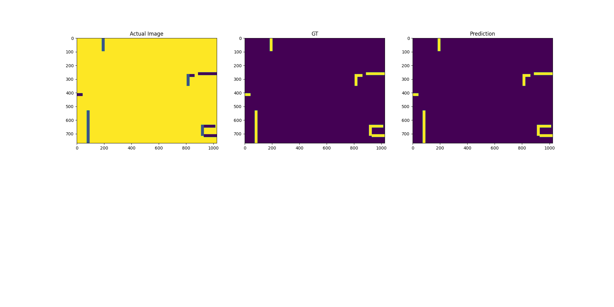

# Smarter-Vision-Assist
Continued work on Smart Vision Assist - Phase 2

This project mainly works in 3 stages

### Stage 1:
___
#### Floor plan Segmentation</b>

In this stage, a trained floor plan segmentation model is used to segment the portions of the floor plan. Background with pixel value '0' is 
considered as movable region and pixel value '1' is considered as an obstable i.e., Walls/ Rectangles in this case

This model is trained on custom autogenerated floor plans and labels 
[ Created using openCV and numpy - as the labelling of real floor plans are tedious and
time consuming ]

**Refer /data/ for the files created***
___
#### 1 . Model Config

* <b>Architecture</b>  - U-Net
* <b>Backbone</b>  - Resnet-18
* <b>Epoch</b>  20
* <b>Steps per epoch</b>  - 200

##### 2 . Model Results
* <b>Train IoU</b>  - .99
* <b>Val IoU</b>  - .99
* <b>Test IoU</b>  - .95

Training Curves:

Output of Prediction:

### Stage 2:
___
#### Translating Prediction to OpenCV Pixel Data</b>

In this stage, the prediction provided by the floor plan segmentation model
is read using open CV and contours are drawn around the obstacles or pixels which are
classified as obstacles '255'

These contours are constructed using the object Rect
and each of these rectangles are stored in a list of obstacles

After this, all the obstacles from the list of obstacles are constructed as rectangles 
using the step size mentioned in configuration file

### Stage 4:
___
#### Path Planning - A Star</b>

Using the standard A* path planning algorithm, we construct the path once the 
user position and destination position is locked

<b>The path planned is considered to be optimal and shortest</b>

Once the path is constructed in accordance to the step size, the same will be drawn on the canvas

### Stage 4:
___
#### Obstacle Placing - Obstacle Avoidance - Re-Routing</b>

Once the initial path is planned, the robot [circle with arrow in the UI] starts to move along
the path planned.

Robot has a scanner in front of it [ Red hollow rectangle in the UI] which captures the 
pixel information it is scanning and these pixel informations are passed on to the object detection algorithm

If the algorithm identifies the object as an obstacle, then a bounding box is added around the obstacle
if the euclidean distance between the user and obstacle is between 40-60 pixels away.

Then the new collision obstacle is added to the main obstacle list and path planner api is called
for a new path starting from 

** 1.Source - Step after the user position

** 2. Dest - Step after the obstacle

This constructs an alternate path around the obstacle and rejoins the already planned 
initial path

___
### Please Note:

1. Algorithm works best for motion where : Initial Source is towards the left of the final destination
2. Algorithm works good for motion where : Initial Source is towards the bottom of the final destination
3. Edge cases and certain scenarios are not handled yet
4. Download YoLo v3 weights from <a href="https://pjreddie.com/media/files/yolov3.weights">here</a> and place it under /object_detection/weights/ folder

                
